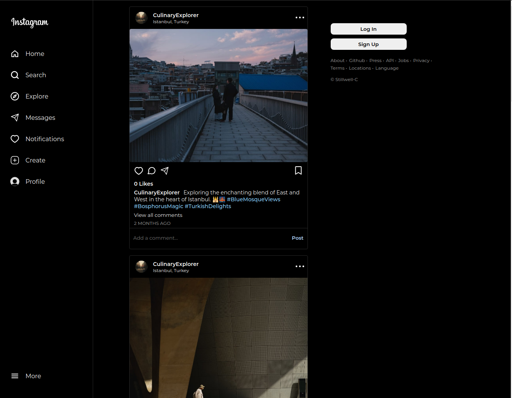

# 그램 카피

이 리포지토리는 인스타그램의 주요 기능을 모방한 MERN 스택 SNS 애플리케이션의 프런트엔드 코드입니다.

이 프로젝트는 [The Odin Project](https://www.theodinproject.com/)의 NodeJS 과정을 따르며 개발한 것입니다.

## Demo

애플리케이션은 [여기](https://gram-copy.vercel.app/)에서 사용할 수 있습니다.

## 백엔드 코드

백엔드 코드는 이 [리포지토리](https://github.com/Stillwell-C/gram-copy-api)를 참조해 주세요.

## 차례

- [내용](#내용)
  - [요약](#요약)
  - [상세 내용](#상세-내용)
    - [UI](#ui)
    - [API & 인증](#api--인증)
      - [사용자 & 인증](#사용자--인증)
      - [데이터 캐싱](#데이터-캐싱)
      - [Cors](#cors)
    - [프런트엔드 데이터 관리](#프런트엔드-데이터-관리)
    - [사용자 및 게시물, 팔로우, 알림](#사용자-및-게시물-팔로우-알림)
    - [웹 접근성](#웹-접근성)
    - [부가 내용](#부가-내용)
  - [알려진 문제](#알려진-문제)
    - [특정 브라우저에서 인증 및 지속적 로그인](#특정-브라우저에서-인증 및-지속적-로그인)
- [기술 스택](#기술-스택)
- [스크린샷](#스크린샷)
  - [데스크탑](#데스크탑)
  - [모바일](#모바일)

## 내용

### 요약

- MERN 스택 / REST API
- 반응형 모바일 퍼스트 (mobile-first) UI
- TanStack Query (React Query)
- Redis 데이터 캐싱
- 토글 가능한 라이트모드와 다크모드
- JWT Refresh & Access 토큰 인증
- 사용자 계좌를 등록/수정/삭제
- 사전을 첨부한 게시물 공유/수정/삭제
- 게시물에 사용자를 태그 기능
- 게시물 좋아요 누르고 게시물 저장 가능
- 태그된 게시물와 저장한 게시물 프로파일에서 찾음
- 게시물에 댓글을 남김
- 다른 사용자를 팔로우하면 그 사용자 게시물 피드에서 나옴
- 사용자 검색
- 새로운 폴로우, 댓글, 좋아요 받을때 알림
- 게시물 위치로 게시물을 검색
- 댓글, 프로파일에세 @ & # 외브 링크 (@ - 사용자 프로파일 링크, # - 같은 해시태그을 포함하는 게시물 피드 링크)
- A11y 웹 접근성

### 상세 내용

인스타그램의 핵심 기능을 복제하려고 개발한 웹 애플리케이션입니다.

#### UI

작은 모바일 화면부터 큰 컴퓨터 디스플레이까지 모두 잘 작동하도록 반응형 모바일 퍼스트 (mobile-first) 방식으로 UI를 설계했습니다. 모든 스타일링은 SCSS로 구현하였습니다.

네비게이션 메뉴에서 라이트 모드와 다크 모드를 토글할 수 있습니다. 사용자가 선호하는 UI 모드는 로컬 스토리지에 저장되어 있어, 사이트에 접속할 때 자동으로 해당 모드로 UI가 변환됩니다. 만약 로컬 스토지지에 저장된 UI 모드가 없다면 브라우저 설정에 따라 UI가 결정됩니다. 로컬 스토리지와 브라우저 설정에서 선호하는 UI 모드에 대한 데이터가 없으면 기본적으로 라이트 모드로 표시됩니다.

#### API & 인증

##### 사용자 & 인증

사용자가 등록하면 이메일과 암호로 로그인할 수 있습니다. [bcrypt](https://www.npmjs.com/package/bcrypt) 패키지를 사용해 데이터베이스에 저장된 암호는 등록 과정에서 암호화되며 인증 과정에서 복호화됩니다.

백엔드는 HTTP only secure 쿠키에 저장된 JWT refresh 토큰과 Redux store에 저장된 15분 유효 기간의 JWT access 토큰으로 인증을 확인합니다. 보안 문제를 피하기 위해 토큰은 로컬 스토리지에 저장되지 않습니다.

로그인된 사용자가 페이지를 리브레시하여 redux store가 삭제된 경우 등 access 토큰을 보유하지 않은 상황이나 백엔드에 보낸 요청이 유효 기간이 지난 access 토큰으로 거부당하는 경우가 있으면 프런트엔드가 자동으로 사용자 refresh 토큰을 API refresh 토큰 엔드포인트로 보내고 백엔드가 전송하는 새 access 토큰을 저장한 다음에 원래 요청을 재시도 합니다. 이 과정은 몇번 실패시에 사용자가 로그아웃되고 오류 메시지를 표시하는 로그인 페이지로 이동됩니다.

로그인된 사용자가 페이지를 리프레시하여 redux store가 초기화된 경우나 access 토큰이 없는 상황, 또는 백엔드에 보낸 요청이 유효 기간이 지난 access 토큰으로 인해 거부되는 경우, 프런트엔드는 자동으로 사용자 refresh 토큰을 API의 refresh 토큰 엔드포인트로 보냅니다. 백엔드는 새로운 access 토큰을 발급하여 저장한 후, 원래 요청을 재시도합니다. 이 과정이 여러 번 실패하면 사용자는 로그아웃되며, 오류 메시지와 함께 로그인 페이지로 이동됩니다.

일부 API 엔드포인트를 요청하려면 유효한 JWT가 필요합니다. JWT 인증은 [jsonwebtoken](https://www.npmjs.com/package/jsonwebtoken) 패키지를 통해 이루어집니다. 사용자 피드 요청, 게시물 데이터 수정 등 사용자 ID가 백엔드에서 사용될 때는 복호화된 access 토큰으로 제공되며, 프론트엔드 입력 양식이나 사용자가 수정 가능한 데이터로 전송되지 않습니다. 유효한 JWT가 필요한 API 엔드포인트에 해당하는 페이지도 보호된 경로(protected route)로 프론트엔드에서 로그인된 사용자만 접속할 수 있습니다. 일부 API 엔드포인트는 유효한 JWT가 필요하지 않지만 JWT 데이터를 활용할 수 있도록 백엔드는 유효한 JWT가 포함된 요청을 받으면 선택적으로 복호화하는 미들웨어를 사용합니다.

사용자가 3시간 내에 5번 틀린 암호로 로그인 시도할 경우, 15분 동안 로그인 정지됩니다. 이 기능은 [rate-limiter-flexible](https://www.npmjs.com/package/rate-limiter-flexible/v/0.9.2) 패키지와 MongoDB 데이터베이스 컬렉션을 사용하여 구현되었습니다.

##### 데이터 캐싱

3가지 API 엔드포인트에서 Redis를 이용하여 게시물 데이터와 사용자 데이터를 캐싱합니다. 현재는 이 엔드포인트에서만 사용되지만, 앞으로 애플리케이션 곳곳에 Redis를 활용하여 성능 향상을 증진할 계획입니다.

첫째 캐싱된 데이터 유형은 사용자 프로필 페이지에서 나오는 사용자가 공유한 게시물입니다. 이 데이터는 최대 24시간 동안 캐시에 보관되며, 사용자가 게시물을 새로 공유하거나 수정, 삭제하는 경우 캐시가 무효화됩니다 (cache invalidation). 게시물의 좋아요, 댓글 등은 데이터베이스에서 따로 보관되어 이러한 데이터의 변화로 인해 캐시를 무효화할 필요 없이 게시물과 다른 데이터베이스 요청으로 현재 데이터 상태를 정확하게 표시할 수 있습니다.

둘째 캐싱된 데이터 유형은 해시태그나 게시물 위치를 클릭하여 나오는 게시물 피드 데이터입니다. 새로운 게시물이 추가되면 캐시가 자동으로 무효화되지 않지만 이 데이터는 캐시에 최대 15분 동안 보관됩니다. 따라서 특정 조건 없이 데이터가 항상 현재 상태를 잘 반영할 수 있습니다.

셋째 캐싱된 데이터 유형은 홈 피드와 엑스플로러(탐색) 피드에서 태블릿, 컴퓨터 등 큰 화면에서 볼 수 있는 인기 사용자 목록입니다. 이 데이터는 24시간 동안 유효하며 이 기간 내에는 자동으로 무효화되지 않습니다.

##### Cors

백엔드에서 [cors](https://www.npmjs.com/package/cors) 패키지를 이용하여 특정 출처에서만 API에 접근할 수 있도록 설정되어 있습니다. 현재는 프런트엔드에서만 접근이 가능합니다.

#### 프런트엔드 데이터 관리

Axios을 사용하여 백엔드에 요청을 보내고, Tanstack Query (이전에는 React Query로 알려졌던 패키지)를 사용하여 프론트엔드에서 데이터를 캐싱합니다. 처음에는 Redux Toolkit과 RTK Query를 사용하려고 했으나, 무한 스크롤을 위한 캐싱 기능에 많은 어려움을 겪었습니다. 개발 당시 Stack Overflow 등의 개발자 포럼에서도 이와 관련된 어려움을 많이 확인할 수 있었습니다.

사용자가 API에서 받은 데이터를 수정하면, 예를 들어 게시물에 좋아요를 누르거나 사용자를 팔로우할 경우, 프론트엔드는 해당 수정을 API에 전송하고 캐시된 데이터를 업데이트하거나 무효화합니다. 업데이트 과정에서 해당 게시물을 포함하는 여러 피드 데이터와 사용자 프로필 데이터가 수정되어 현재 상태를 정확하게 반영합니다. 데이터가 무효화되면, 페이지네이션 여부에 따라 해당 데이터를 포함하는 캐시 데이터의 일부 또는 전체가 재요청될 수 있습니다.

Redux Toolkit은 주요 프론트엔드 데이터 캐시로 사용되지 않으며, 사용자 JWT Access 토큰은 Redux store에 저장된 유일한 API 데이터입니다.

#### 사용자 및 게시물, 팔로우, 알림

등록하지 않고도 로그인된 사용자만이 경험할 수 있는 기능을 원하시는 분들을 위해, 나비게이션 메뉴에 있는 "Try Test Account" 버튼을 클릭하여 시범 계정으로 애플리케이션을 사용해보실 수 있습니다. 이 시범 계정에서는 암호 변경, 아이디 변경, 계좌 삭제 등 일부 기능이 제한됩니다.

등록하려면 "Sign up" 버튼을 클릭하세요. 등록 페이지에서 입력 양식은 실시간으로 사용자가 입력한 데이터가 이미 등록된 사용자와 겹치지 않도록 확인하며, 정해진 조건을 충족하는지도 검증하여 적합하지 않은 경우 색깔과 오류 메시지로 표시됩니다.

로그인된 사용자는 이미지를 포함한 게시물을 공유하고 수정할 수 있으며, 한 게시물 당 최대 20명까지 사용자를 태그할 수 있습니다. 또한, 게시물에 좋아요를 누르고 저장하며, 댓글을 남길 수 있습니다. 저장된 게시물은 본인의 프로필 페이지의 "Saved" 탭에서 확인할 수 있으며, 이는 본인만 볼 수 있는 컨텐츠입니다. 태그된 게시물은 사용자의 프로필 페이지의 "Tagged" 탭에서 볼 수 있습니다.

사용자가 ID, 아바타 등 프로필 정보를 모두 수정할 수 있다. 다만, 닉네임, 이메일은 다른 사용자와 겹치지 않습니다. 또한 암호를 입력 하면 계정을 삭제할 수 있는데 상기의 rate-limiter-flexible도 이용하여 맞지 않은 암호를 여러번 입력하면 15분동안 정지될 수 있습니다. 계정 삭제시에 사용자의 공유한 게시물, 사용자와 관련된 팔로우 등 모두 삭제됩니다. 그래서 본인은 팔로우한 사용자가 계정을 삭제하면 본인의 팔로우잉 수가 1명으로 줄어든다. 현재까지 방대한 게시물을 고유한 사용자가 삭제된 경우가 없으니 백엔드에서 성능이 떨어지거나 다른 문제가 유발되는지를 모그며 이 과정에 대하여 계속 모니터링할 계획입니다. 삭제된 사용자 댓글과 알림은 볼 수 있지만 과거에 등록된 ID 대신 "Deleted User"으로 표시되고 "Deleted User"를 클릭하면 프로필페이지로 이동되지 않습니다.

사용자는 ID와 아바타를 포함한 프로필 정보를 모두 수정할 수 있습니다. ID과 이메일은 다른 사용자와 중복되지 않도록 설정되어 있습니다. 또한 암호를 입력하면 계정을 삭제할 수 있으며, 상기 상기의 rate-limiter-flexible를 통해 이 과정에서 맞지 않은 암호를 여러 번 입력하면 15분 동안 정지될 수 있습니다. 계정 삭제 시 사용자가 공유한 게시물과 관련된 팔로우 등 모든 데이터가 삭제됩니다. 따라서 사용자가 팔로우한 다른 사용자가 계정을 삭제하면 본인의 팔로잉 수가 감소합니다. 삭제된 사용자의 댓글과 알림은 볼 수 있지만, ID 대신 "Deleted User"로 표시되며, 해당 사용자를 클릭하면 프로필 페이지로 이동되지 않습니다.

사용자가 차단되면 해당 프로필은 검색 결과에서 나타나지 않으며, 프로필 페이지에 접속하면 차단된 사용자임을 알리는 메시지가 표시됩니다.

댓글, 프로필 자기소개 등의 텍스트 컨텐츠 앞에 해시태그(#)를 붙이면 해당 해시태그를 포함하는 게시물을 볼 수 있는 피드로 이동하는 링크가 생성됩니다. 사용자가 게시물을 공유할 때 첫 번째 댓글로 표시되는 게시물 설명을 추가할 수 있으며, 이 설명을 기반으로 해시태그 피드에서 검색 결과가 나타납니다. 다른 사용자가 남긴 댓글 안의 해시태그는 검색되지 않습니다. 사용자 이름 앞에 골뱅이(@)를 붙이면 해당 사용자의 프로필로 이동하는 링크가 생성됩니다.

사용자가 게시물에 위치 정보를 입력한 경우, 해당 위치는 게시물에서 사용자 ID 아래에 링크로 표시됩니다. 이 링크를 클릭하면 같은 위치를 가진 게시물을 볼 수 있는 피드로 이동합니다.

다른 사용자를 팔로우하면 홈 피드에서 해당 사용자 게시물이 나오며 [엑스플로러(탐색) 피드](https://gram-copy.vercel.app/explore)로 이동하면 모든 사용자가 공유한 게시물을 볼 수 있습니다. 모든 피드에서 게시물은 공유한 시기에 따라 순서대로 표시됩니다.

다른 사용자를 팔로우하면 홈 피드에서 해당 사용자의 게시물이 포함되며, [엑스플로러(탐색) 피드](https://gram-copy.vercel.app/explore)로 이동하면 모든 사용자가 공유한 게시물을 볼 수 있습니다. 모든 피드에서 게시물은 공유된 시간에 따라 순서대로 표시됩니다.

네비게이션 검색 입력 양식을 이용하여 등록된 사용자를 검색할 수 있습니다.

사용자 프로필이나 게시물에서 3점 아이콘을 클릭하면 URL 복사와 게시물 정보 수정, 게시물이나 사용자 신고 등의 추가 옵션 메뉴가 나타납니다.

알림 페이지로 이동하면 알림을 볼 수 있습니다. 새로운 팔로우 받거나 공유한 게시물에서 좋아요 받거나 새로운 댓글이 달리면 새로운 알림이 나타납니다.

알림 페이지로 이동하면 새로운 팔로우, 좋아요, 또는 댓글에 대한 알림을 확인할 수 있습니다.

#### 웹 접근성

특히 입력 양식과 오류 메시지, 모달에 대해 이 애플리케이션은 스크린 리더 등 웹 접근성을 고려하여 개발하려고 노력했습니다. 물론 ARIA나 웹 접근성 모범 사례(best practices)를 잘못 사용한 적이 있을 수 있지만, 웹 접근성의 중요성을 인지하고 애플리케이션의 접근성을 향상시킬 수 있는 요소나 권장 사항이 있다면 연락 부탁드립니다.

사용자는 게시물 이미지에 대한 alt 텍스트를 게시물을 공유할 때 입력할 수 있습니다. 나중에는 AI 분석을 통해 사용자가 입력하지 않은 경우 게시물에 맞춤형 AI alt 텍스트를 생성할 계획입니다.

스크린리더 호환을 위해 [focus-trap-react](https://www.npmjs.com/package/focus-trap-react) 패키지를 사용하여 모달이 열릴 때 포커스가 모달 내로만 제한됩니다. 모든 모달은 ESC 키를 사용하여 닫을 수 있습니다.

#### 부가 내용

애플리케이션의 이전 버전은 Firebase를 백엔드로 사용하며 채팅 기능도 포함되어 있었습니다. 현재는 채팅 기능이 제외되었지만 앞으로 다시 추가할 계획입니다.

이 애플리케이션의 프로필, 댓글, 게시물 내용 등 대다수의 텍스트는 ChatGPT를 통해 생성되었습니다. 게시물 정보, 해시태그, 위치 등 텍스트 내용은 게시물 이미지와는 관계가 없습니다. 애플리케이션 기능을 최대한 발휘하기 위해 해시태그와 위치 등은 20여 개의 조합으로 한정됩니다.

모든 이미지 컨텐츠는 [unsplash](https://unsplash.com/)에서 다운로드한 저작권이 없는 이미지입니다. 이 애플리케이션에서 사용된 unsplash 이미지는 원래의 창조자와 관련이 없으며 모든 내용이 허구임을 알립니다.

## 알려진 문제

### 특정 브라우저에서 인증 및 지속적 로그인

- 로컬 환경에서 개발할 때 애플리케이션은 로그인된 상태를 확인할 수 있는 refresh 토큰 쿠키와 별도의 쿠키를 사용했습니다. 하지만 프런트엔드 호스트인 Vercel이 [public suffix list](https://publicsuffix.org/)에 등록되어 있어서, 호스팅된 후에 애플리케이션은 이 쿠키에 접근할 수 없었습니다. 이 문제를 해결하기 위해 로그인 시 로컬 스토리지에 "loggedIn"이라는 키를 설정합니다. 쿠키를 사용하는 코드가 프런트엔드와 백엔드에 남아 있어, 쿠키와 로컬 스토리지 방식을 모두 사용하여 로그인 상태를 지속할 수 있습니다. 보안 문제를 방지하기 위해 Access 및 refresh 토큰을 포함한 JWT 토큰은 로컬 스토리지에 저장하지 않습니다. 로그아웃 시 로컬 스토리지에 "loggedIn" 키가 저장되어 있으면 이를 false로 변경합니다.

- 이 demo 애플리케이션의 호스팅 비용을 절약하기 위해 프런트엔드는 [Vercel](https://vercel.com/)에서, 백엔드는 [Railway](https://railway.app/)에서 호스팅합니다. 따라서 refresh 토큰을 저장하는 HTTP only, secure 쿠키가 cross-site 쿠키가 되어, 사파리 브라우저와 여러 브라우저의 시크릿 모드 등 특정 브라우저에서 지속적 로그인이 제대로 동작하지 않습니다. 사용 중인 브라우저가 cross-site 쿠키를 금지하면 지속적 로그인이 불가능하며 페이지를 리프레시하면 로그아웃됩니다.

- 애플리케이션은 로컬에서 실행하면 상기 문제가 발생하지 않습니다.

## 기술 스택

### 프런트엔드

- ReactJS
- React Router
- Redux Toolkit
- Axios
- Tanstack-Query
- SASS
- Focus-Trap-React

### 백엔드

- NodeJS
- ExpressJS
- Redis
- MongoDB/Mongoose
- Bcrypt
- Cloudinary (image storage)

## 스크린샷

### 데스크탑

#### User Feed

#### User Profile

#### User Search

#### Notifications

#### Create Post

#### Edit User Info

#### Post Options

#### View Followers / Following

### 모바일

#### User Feed

#### User Profile

#### Post

