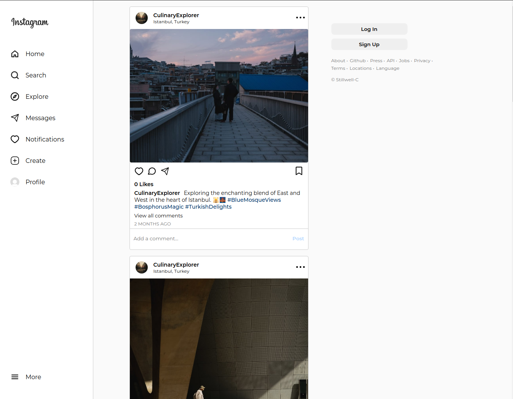
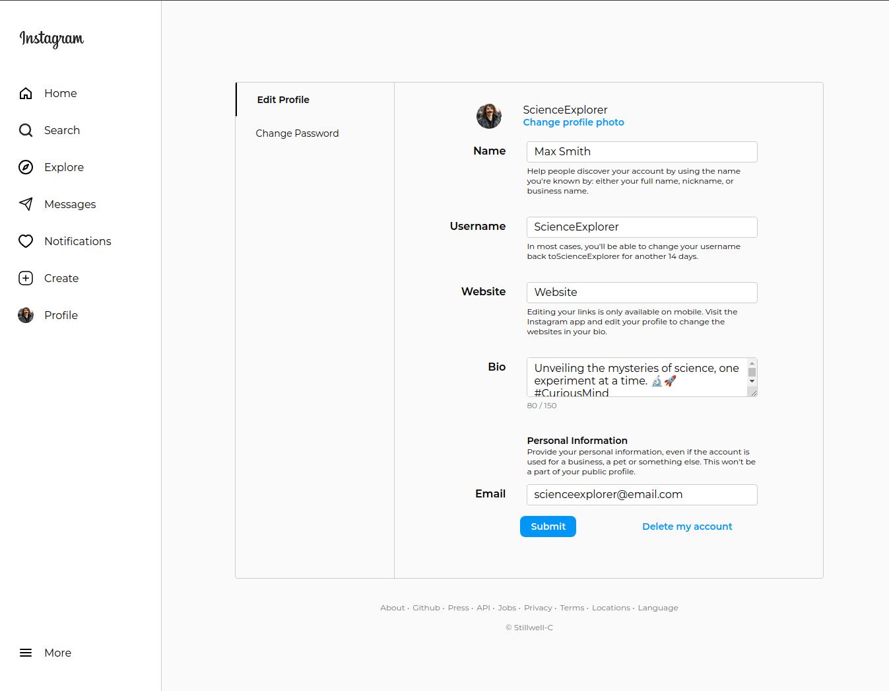
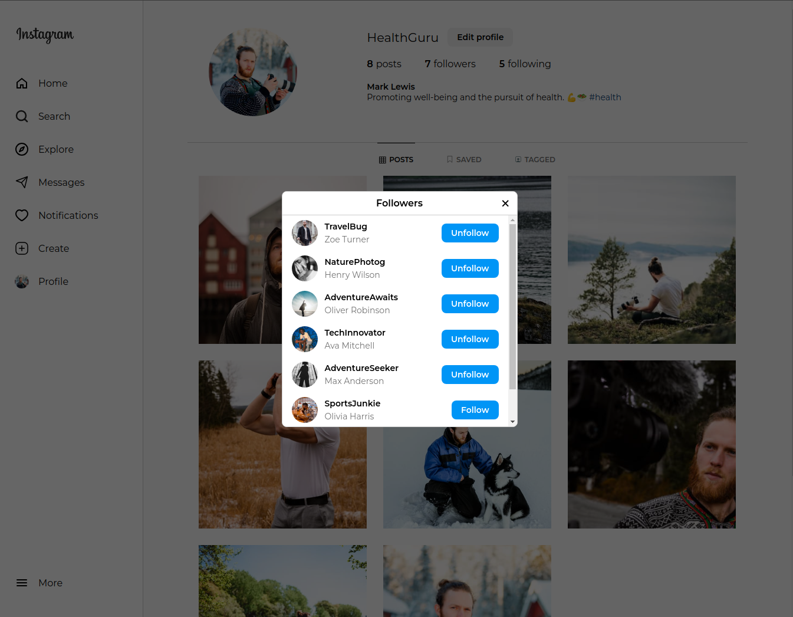

# Gram Copy

This repository is the frontend for Gram Copy, a MERN stack social media application inspired heavily by Instagram.

I made this while following the NodeJS course from [The Odin Project's](https://www.theodinproject.com/) curriculum.

## Demo

The application is live at https://gram-copy.vercel.app/

## Backend code

View the backend code [here](https://github.com/Stillwell-C/gram-copy-api)

## Description

### Overview

- Built using MERN stack / REST API
- Reponsive, mobile-first UI
- TanStack Query (React Query)
- Redis for data caching
- Toggleable dark and light mode
- Authentication with JWT refresh & access tokens
- Create/edit/delete user accounts
- Create/edit/delete posts with images
- Tag users in your own posts
- Like or Save posts
- Comment on posts
- Follow other users to see their posts in your feed
- Seach users
- Get notifications for new followers, comments, and likes
- View posts from specific locations
- Link to users using the @ symbol & posts using a hashtag with the # symbol
- A11y accessibility (to the best of my ability)

### Detailed Description

This application was made to clone most of Instagram's basic functionality.

#### UI

The UI was made to be responsive with a mobile-first design and should function on both mobile devices and web browsers with larger screens. SCSS was used to style most components.

There is a dark and light mode that can be toggled through the navigation menu. A user's preference will be stored in local storage for the next time they visit the site. If no user preference is stored in local storage, the initial theme will be set using the user's preferred color theme in their browser if present. If there is no preferred theme in their browser or theme in local storage, it will default to the light color theme.

#### API & Authentication

##### Users & Authentication

Users can create an account and sign in using their email or username and a password. Passwords are encrypted/decrypted and verified using the [bcrypt](https://www.npmjs.com/package/bcrypt) package.

Authentication is handled with a JWT refresh token stored in an HTTP only secure cookie and a separate JWT access token stored in a redux store with a 15-minute expiration. These tokens are never stored in local storage.

If a user is logged in and does not have a JWT access token (e.g. the user has refreshed their page) or has sent a request to the sever that has been rejected due to an expired access token, the front end will automatically send the user's refresh token to the API's refresh route and save the access token received before reattempting the user's initial request. If this process fails, the user will be logged out and given an error message to log in again.

Specific routes require a valid JWT access token to access. JWT verification is done using the [jsonwebtoken](https://www.npmjs.com/package/jsonwebtoken) package. Anytime a user's ID is used on the backend (e.g. requesting a user's feed, updating data, etc.), this is supplied by the decoded access token, not by a userID sent directly from the front end. Pages for routes requring a JWT to access are also protected on the frontend (with protected routes) and require a user to be logged in to access. In some cases, a route does not explicitly require a JWT, but a selective JWT verification middleware will verify and decode the JWT if one is provided.

Users are limited to 5 attempts with a incorrect passwords in a 3-hour span before being locked out for 15 minutes. This is implemented using the [rate-limiter-flexible](https://www.npmjs.com/package/rate-limiter-flexible/v/0.9.2) package and a MongoDB collection.

##### Data Caching

Redis is used to cache the post data on two different API routes. These are currently the only parts of the site where it is employed, but I would like to expand implementation of Redis to improve overall site performance.

The first type of cached post data is for the posts displayed on user profiles. This data is held for a maximum of 24 hours and is invalidated if a user uploads a new post, edits an existing post, or deletes an existing post. I do not invalidate the cache for updates to the number of likes or comments (which are currently stored on the post itself but may be entirely removed in the future), but separate queries for these counts should resolve any potential inconsistencies.

The second type of cached post data is for posts that are searched for via clicking on a hashtag or a post's location. This data is not invalidated by adding a new post with this hashtag or location, but the data is only stored for 15 minutes to allow for this data to be relatively up to date.

Caching data for posts does not affect the display of comments made after the post data was cached and accurate display of whether the user has liked or saved the post as these are all handled by separate queries.

##### Cors

The [cors](https://www.npmjs.com/package/cors) package is used to only allow requests from specific origins. In this case, I am only allowing requests originating from the frontend.

#### Font end data management

Axios is used to make server requests and Tanstack Query is used to cache/invalidate data on the front end. I originally attempted to use Redux & RTK query for this, but found the caching system, especially with regard to infinite scrolling, limiting. Altering data receieved from the server (such as liking a post or following a user) will update the cache or will invalidate the cache (requiring refetch of some or all of the data). This works well for data across the cache in most cases (if you like a post, I intend for all instances of that post to be invalidated including in the multiple types of image feeds and on a user's profile even when this means invalidating a whole feed); however, there may be some limited cases where some cached data is not perfectly updated or cached. I hope to continue to hone this feature for better performance and user experience. Redux is also used in this application, but the user's JWT access token is the only server data that is stored in the redux store.

#### Users, Posts, Follows, and Notifications

Users can create and edit their own posts (posts must include an image) and can tag up to 20 users on each post. Any logged in user can like, save, and comment on posts. Saved posts can be viewed on your own account on the "saved" tab (this is only visible to you) and images a user is tagged in can be viewed through the "tagged" tab of their profile.

Users can edit all profile information including their username and profile image (however, not to the same username or email as another user). They may also delete accounts by entering their correct password (rate-limiter-flexible is also used here to lock after 5 attempts with an incorrect password). This action will also delete all the user's posts as well as all of the follows associated with their account (i.e. if you follow a user who then deletes their account, the number of users you are following should decrease by 1). I do, however, see this as an area of the API with potential performance or other unintended consequences and hope to continue to refine this process. Comments and notifications from a deleted user will still be visible, however, the name will be changed to Deleted User and no link will be provided to their account.

Visit a user's profile to see their posts, posts they are tagged in, user information, the users following them, and the users they follow.

A user profile can be banned, in which case the profile will not be accessible or searchable.

Add a hashtag or at sign in front of text (comments, bio, etc.) to link to a hashtag search or a user's profile. Clicking on text starting with an @ symbol with link you to the user's profile page. Clicking on text starting with a # symbol will link you to posts where the user has used the hashtag in their initial caption for the post (displays as the first comment).

The locations displayed on each image can be clicked to search for other posts from the same location.

Follow other users to see their posts in your feed or go to the [explore page](https://gram-copy.vercel.app/explore) to see posts from all users. All posts are shown in order of the date they were created.

Users can be searched through the searchbar in the navigation menu.

Click on the three dot icon of a post or user profile to see additional options such as copying a post's URL, editing post information (if you are the post's author), or reporting a post or user.

Click on the notifications tab to see notifications for any time another user follows your account or likes or comments on one of your posts.

#### Accessibility

Throughout this project, I have tried to make this website accessible to screen readers, especially with respect to forms, error messages, and modals. However, any input on how to improve on this is greatly appreciated. I am sure there are instances where I have misused or neglected to properly implement ARIA or other accessibility best practices.

Users are able to add custom alt text for the images in their posts. If users do not provide this, blanket alt messages are offered that do not describe the content of the images.

The [focus-trap-react](https://www.npmjs.com/package/focus-trap-react) package is used to trap focus when a modal is present on the screen. All modals can be exited using the escape key.

#### Additional Info

Chatting was implemented on an earlier version of this website with a Firebase backend, and I plan to update this to work on my own backend in the future.

Almost all text content (profiles, comments, post information, etc.) was generated using ChatGPT. Post information, hashtags, location, etc. does not match images in most cases. The number of locations and hashtags for the initial post data was intentionally limited to better demonstrate how these features can be used.

All images were found on [unsplash](https://unsplash.com/). Profiles and posts with the initial data (any that has been created by me) do not and are not meant to reflect the original image posters.

## Known Issues

### Authentication

- Persisting user login was originally done using a cookie to show that a user was logged in (as the access token can easily be deleted by refreshing the browser). However, possibly due to Vercel being on the [public suffix list](https://publicsuffix.org/), I could not access this cookie once the site was live. To remedy this, a single item called "loggedIn" is set in local storage upon log in. The code utilizing a cookie was not deleted from the front or back end, and either a cookie or local storage item can be used for this functionality. No JWT (access or refresh token) is stored in local storage at any time. Logging out will remove the loggedIn cookie (if present) and set the "loggedIn" item to false.

- The frontend is hosted on [Vercel](https://vercel.com/) and the backend is hosted on [Railway](https://railway.app/). Resultingly, the refresh token stored in an HTTP only secure cookie is a cross-site cookie and does not function properly on some browsers, particularly some incognito or private browser windows such as Chrome and Opera. Refreshing the page will log you out on these browsers in incognito windows.

## Built with

### Frontend

- ReactJS
- React Router
- Redux Toolkit
- Axios
- Tanstack-Query
- SASS
- Focus-Trap-React

### Backend

- NodeJS
- ExpressJS
- Redis
- MongoDB/Mongoose
- Bcrypt
- Cloudinary (image storage)

## ScreenShots

### Desktop

#### User Feed

#### User Profile

#### User Search

#### Notifications

#### Create Post

#### Edit User Info

#### Post Options

#### View Followers / Following

### Mobile

#### User Feed

#### User Profile

#### Post

